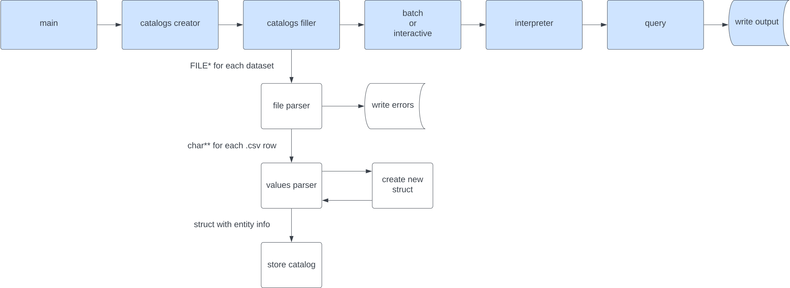

# Trivial Booking

## About the Project

This project was developed for the LI3 University of Minho Subject of the Software Engineering degree.

##### Developed by:

- [Afonso Pedreira](https://github.com/afooonso)
- [Dário Guimarães](https://github.com/darguima)
- [Hugo Rauber](https://github.com/HugoLRauber)

#### Data Flow



## Getting Started

### Installing dependencies

```bash
# Ubuntu
$ sudo apt-get install libglib2.0-dev clang-format valgrind doxygen

# Arch
$ sudo pacman -S glib2 clang valgrind doxygen
```

#### Cloning the repository

```bash
$ git clone https://github.com/dium-li3/grupo-45.git
```

#### Running the project

First of all, enter on `trabalho-pratico` folder:
```bash
$ cd trabalho-pratico
```

##### Compiling the code
```bash
$ make

# With debug flags
$ DEBUG=1 make

# Executing
$ ./programa-principal 
$ ./programa-principal <dataset-folder> <input-file>
```

##### Developing

This function `clean`, `format`, `compile` in debug mode and `execute` the project

```bash
$ make dev
$ make dev <dataset-folder> <input-file>
```

##### Running memory leaks checks

Will run Valgrind to detect memory leaks
This also compiles the code, and pass default params to the executable

```bash
$ make check-memory
$ make check-memory <dataset-folder> <input-file>
```

##### Cleaning object files and executable
```bash
$ make clean
```

##### Formatting the code
```bash
$ make format
```
