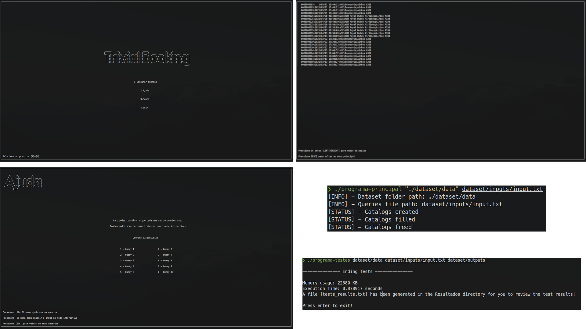
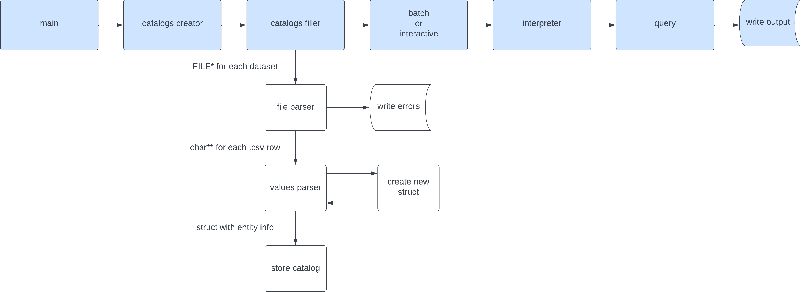

# Trivial-Booking LI3

## About the Project

This project was developed for the LI3 University of Minho Subject of the Software Engineering degree.

The project has some minor bugs due our skill issues, and after the deadline nobody had time to fix them, because we are spending our time on other projects.

Although the project is not perfect, we are proud with the work we have done.

#### Grade ⭐️ 18/20

### Demo 📽️



### The goal ⛳️

In some words, the goal of this project was create a C program that could handle a large dataset of hotels, flights and reservations, and answer to some queries about the data. The solution should follow an encapsulated and modular approach.

If you want, you can read the [project statement](enunciado.pdf) (in Portuguese).

### About the Code 🧑‍💻

The main goal of this subject was to learn how to develop a modular and encapsulated code, so we divided the code in some folders.

##### Entities

Represents the entities of the project, like `user`, `hotel`, `flight`, `airport` and `reservation`. Each `user/hotel/...` will have a struct allocated in memory to represent it, but the struct fields will be encapsulated from the remaining project.

##### Catalogs

Store all the entities of the project. Each catalog will use the data structures that best fits the solutions for the queries. We are using GLib to handle the `trees`, `lists`, `arrays` and `hash tables`.

### Program Flow 📈

The program flow is represented in the following image.



## Getting Started 🚀

#### Cloning the repository

```bash
$ git clone https://github.com/Darguima/Trivial-Booking-LI3.git
$ git clone git@github.com:Darguima/Trivial-Booking-LI3.git
```

### Installing dependencies 📦

```bash
# Debian / Ubuntu / Mint
$ sudo apt-get install libglib2.0-dev libncurses-dev clang-format valgrind doxygen

# Arch
$ sudo pacman -S glib2 clang valgrind doxygen
```

#### Running the project 🏃‍♂️

Start by going to `trabalho-pratico` folder:

```bash
$ cd Trivial-Booking/trabalho-pratico/
```

##### Downloading the Dataset 📂

In order to test with "real" data, download our datasets:

```bash
$ wget https://github.com/Darguima/Trivial-Booking-LI3/releases/download/phase_1/dataset.zip
$ unzip dataset.zip
```

##### Compiling the code 🛠️
```bash
$ make

# With debug flags
$ DEBUG=1 make

# Executing program
$ ./programa-principal 
$ ./programa-principal <dataset-folder> <input-file>

# Executing performance tests
$ ./programa-testes <dataset-folder> <input-file> <correct-output-folder>
```

##### Developing

This function `clean`, `format` and `compile` in debug mode and `execute` the project

```bash
$ make dev
$ make dev <dataset-folder> <input-file>
```

##### Running memory leaks checks

Will run Valgrind to detect memory leaks.
This also compiles the code, and pass default params to the executable.

```bash
$ make check-memory
$ make check-memory <dataset-folder> <input-file>
```

##### Running unitary checks

Will run a python script that will check each output of the program with the expected output. (Not 100% accurate if have void file outputs)

```bash
$ make test
```

##### Cleaning object files and executable
```bash
$ make clean
```

##### Formatting the code
```bash
$ make format
```

## Developed by 🧑‍💻:

- [Afonso Pedreira](https://github.com/afooonso)
- [Dário Guimarães](https://github.com/darguima)
- [Hugo Rauber](https://github.com/HugoLRauber)
