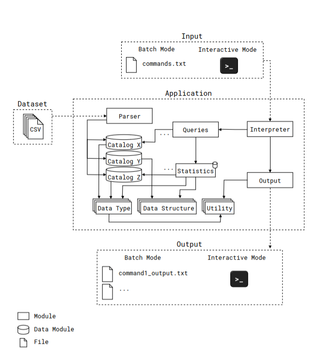

# Notas

## Fases

É necessário apresentar um relatório de 10 páginas por fase.

1) 11/11/2023

2) 15/1/2024

### Modos de funcionamente

### Batch (1º fase)

Recebe dois argumentos:
1) caminho para a pasta dos fich de entrada
2) caminho para um ficheiro com comandos

E tem o seu output para ficheiros na pasta de `Resultados`

### Interativo (2º fase)

Não recebe parametros, pedindo os inputs em runtime:

* input do user com caminho para o dataset 
* queries (disponiveis em um catálogo) que vão ser executadas, uma de cada vez

No modo de operação interativo, o grupo é responsável por definir o formato de entrada das queries e o layout dos respetivos resultados. Por exemplo, pode dar ao utilizador a opção de escolher o output com um formato CSV, tabular, campo a campo, entre outros. São valorizadas interfaces que sejam intuitivas e que lidem graciosamente com eventuais erros do utilizador (e.g., passar texto para uma query de top N, indicar uma pasta inválida para o dataset, . . . ).

## Critérios

O que e necessário apresentar por fase

### Fase 1

* Parsing dos ficheiros de entrada;
* Modo de operação batch;
* 60% das queries
* Validação do dataset
* Execução do programa sem memory leaks.
* Testar na plataforma de testes: https://li3.di.uminho.pt/
* Queries não implementadas sem crashar o programa
* Documentação e Modularização

### Fase 2

* Mesmos requisitos da fase 1;
* Totalidade das queries
* Modo de operação interativo, incluindo o menu de interação com o programa e um módulo
de paginação para apresentação de resultados longos;
* Análise e discussão sobre o desempenho da solução desenvolvida, incluindo testes de tempo
de CPU e memória;
* Testes funcionais;
* Evolução dos aspetos relacionados com a modularidade e encapsulamento;
* Adequação da aplicação a um dataset com uma ordem de grandeza superior.
* Documentação e Modularização

## Arquitetura da aplicação por módulos

O projeto deve conter:

* nome do executável "programa-principal" na pasta "trabalho-pratico"
* ficheiro make (com comando clean) na pasta "trabalho-pratico"

E estar organizado pelos seguintes módulos:

| Nome Módulo | Descrição |
|-------------|-----------|
| Parsing dos dados (*Parser*) | módulo no qual é realizada a leitura dos ficheiros de entrada CSV e é efetuado um parsing genérico |
| Interpretação dos comandos (*Interpreter*) | módulo responsável por ler o ficheiro de comandos, interpretar cada um, e executar a respetiva query com os argumentos indicados (se existirem) |
| Execução das interrogações (*Queries*) | módulo responsável por implementar a lógica das in- terrogações, delegando responsabilidades aos respetivos catálogos conforme necessário |
| Output dos dados (*Output*) | módulo no qual é realizada a escrita dos dados para a respetiva saída (consola ou ficheiro) |
| Catálogos de dados (*Catalogs*) | módulos responsáveis por armazenar e processar informações das diversas entidades, como utilizadores, voos, etc. |
| Tipos (*Data Types*) e estruturas de dados (*Data Structures*) | Tipos e estruturas de dados necessários para a representação e armazenamento de dados, respetivamente |
| Estatísticas (*Statistics*) | módulo que efetua relações entre as várias entidades, proporcionando um acesso mais rápido a dados e resultados pedidos nas queries do programa |
| Módulos de utilidade (*Utilities*) | eventuais módulos extra necessários para o desenvolvimento da aplicação |



## Funcionamento da app

O formato para a especificação de queries (dentro do ficheiro de texto) é o seguinte:

`<query-id>[format-flag] [arg1...argN]`

```txt
2  U000000001
2F U000000001
4  H000000001
5  OPO "2023/10/01 00:00:00" "2023/10/01 23:59:59"
```

Ainda no modo de operação batch, o resultado de cada comando deverá ser escrito num ficheiro de texto com nome que seguirá o formato commandX_output.txt(2) e que deverá ser armazenado na pasta “Resultados” da raiz da pasta “trabalho-pratico”. Um exemplo de ficheiro de resultado para a primeira linha seria(3):

> 
```txt
F000000123;2023/10/06;flight
R000000456;2023/10/02;reservation
F000000121;2023/10/01;flight
```

####### (2)Onde X é o número da linha do respetivo comando no ficheiro de comandos.
####### (3)Para queries com inputs inválidos, o ficheiro de output deverá ser criado, mas sem conteúdo.

Caso uma query no modo batch contenha a flag ’F’, o seu resultado deverá ser apresentado com o formato field: value, para além da indicação do número do registo no seu início (através de --- n ---, onde n é o número do registo). Por exemplo, o output do comando 2 seria:

> command2_output.txt
```txt
--- 1 ---
id: F000000123
date: 2023/10/06
type: flight
--- 2 ---
id: R000000456
date: 2023/10/02
type: reservation
--- 3 ---
...
```

## Descrição dos ficheiros de entrada

Descrição dos dados dos CSVs:

### Utilizadores (users.csv)

| key | value |
| --- | ----- |
| id | identificador do utilizador |
| name | nome |
| email | email |
| phone_number | número de telemóvel |
| birth_date | data de nascimento |
| sex | sexo |
| passport | número do passaporte |
| country_code | código do país de residência |
| address | morada |
| account_creation | data de criação da conta |
| pay_method | método de pagamento |
| account_status | estado da conta |

### Voos (flights.csv):

| key | value |
| --- | ----- |
| id | identificador do voo |
| airline | companhia aérea |
| plane_model | modelo do avião |
| total_seats | número de lugares totais disponíveis |
| origin | aeroporto de origem |
| destination | aeroporto de destino |
| schedule_departure_date | data e hora estimada de partida |
| schedule_arrival_date | data e hora estimada de chegada |
| real_departure_date | data e hora real de partida |
| real_arrival_date | data e hora real de chegada |
| pilot | nome do piloto |
| copilot | nome do copiloto |
| notes | observações sobre o voo |

### Passageiros (passengers.csv):

| key | value |
| --- | ----- |
| flight_id | identificador do voo |
| user_id | identificador do utilizador |

### Reservas (reservations.csv)

| key | value |
| --- | ----- |
| id | identificador da reserva |
| user_id | identificador do utilizador |
| hotel_id | identificador do hotel |
| hotel_name | nome do hotel |
| hotel_stars | número de estrelas do hotel |
| city_tax | percentagem do imposto da cidade (sobre o valor total) |
| address | morada do hotel |
| begin_date | data de início |
| end_date | data de fim |
| price_per_night | preço por noite |
| includes_breakfast | se a reserva inclui pequeno-almoço |
| room_details | detalhes sobre o quarto |
| rating | classificação atribuída pelo utilizador |
| comment | comentário sobre a reserva |

Considere ainda que:

* As datas devem seguir o formato aaaa/MM/dd;.
* As datas com tempo devem seguir o formato aaaa/MM/dd hh:mm:ss;
* Os resultados representados por números decimais deverão ser arredondados a três casas
na parte decimal;4
* No modo de operação interativo, caso os resultados excedam a capacidade de uma página,
deverá existir um menu de navegação para consultar as diferentes páginas de resultados;
* Deverá ser considerada a data 2023/10/01 como a data atual do sistema, devendo estar es-
pecificada no código através de um ou mais #define;
* Deverá ser usado o tipo de dados double (e não float) para a representação de valores deci-
mais;
* Caso a query não retorne nenhum resultado (e.g., id inexistente na Q1), o ficheiro resultante
no modo batch deverá ser gerado sem conteúdo (não deverá ser colocado um newline);
* O custo total de uma reserva deve ser calculado com a seguinte fórmula:
preço_por_noite × número_de_noites + preço_por_noite×número_de_noites
100 × imposto_da_cidade;
* O total gasto por um utilizador é calculado a partir da soma dos seus gastos em reservas;
4Notar que um valor médio de, e.g., 3.2, deverá ser apresentado como 3.200. Sugestão: o formato %.3f faz o
arredondamento e coloca os zeros extra caso necessário.
* O número de noites de uma reserva é calculado a partir da diferença entre a datas de início
e fim. E.g., o número de noites para uma reserva com início a 2023/10/01 e fim a 2023/10/02
é 1.
* Para simplificar as queries, numa reserva, a data de início e fim são garantidamente sempre
no mesmo mês. Da mesma forma, as datas estimadas e reais dos voos são também sempre
no mesmo mês;
* Atrasos de um avião são calculados a partir da diferença entre a data estimada de partida
(schedule_departure_date) e a data real de partida (real_departure_date);
* Argumentos de queries podem, opcionalmente, ser rodeados por aspas, quando são formados
por espaços. Por exemplo, o comando 5 OPO “2023/01/01 00:00:00” “2023/12/31 23:59:59” refere-
se à query 5 e é formado por 3 argumentos, OPO, 2023/01/01 00:00:00, e 2023/12/31 23:59:59

## Queries

10 Queries

Ler o conteúdo das queries no PDF.

## Validação de ficheiros de dados

Podem existir determinadas linhas corrompidas, passageiros que não estão registrados, ou clientes inválidos que aligaram quartos ... e é ncessário validar

Ler o conteúdo das validações no PDF

## Testes (2ª fase)

Para a segunda fase é necessário escrever um programa que teste cada query do programa.

Ler o conteúdo dos testes no PDF
